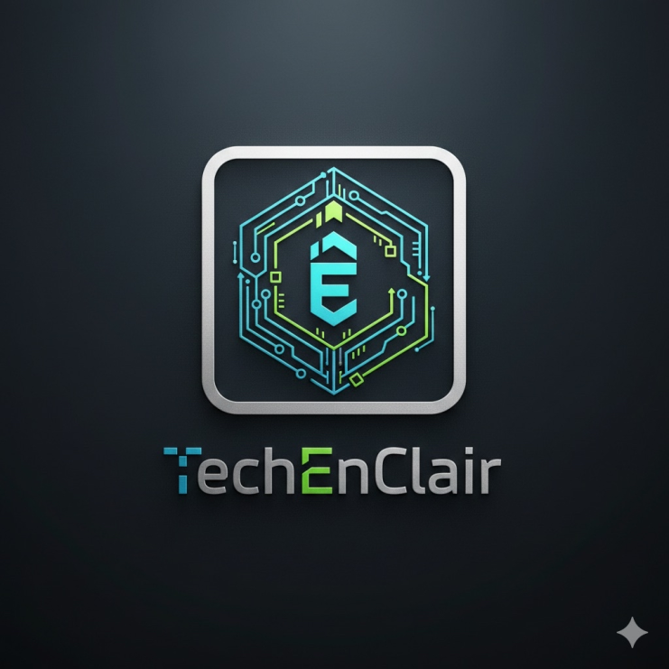

# TechEnClair – Ressources Home Assistant

Ce dépôt sert uniquement à **partager les scripts et ressources utilisés par le créateur TechEnClair sur TikTok** pour Home Assistant.

Les fichiers présents ici permettent de **récupérer facilement les scripts et exemples montrés dans les vidéos**, afin de les tester ou les adapter à votre propre installation.

## TikTok

Retrouvez les vidéos et démonstrations des scripts ici :

TikTok : https://www.tiktok.com/@geekfamily45

## Utilisation

- Parcourez les fichiers disponibles dans le dépôt.
- Copiez le contenu des scripts.
- Adaptez-les à votre configuration Home Assistant (notamment les `entity_id`).

## Questions ou aide

Si vous avez des questions ou besoin d’aide pour utiliser un script, vous pouvez rejoindre le **serveur Discord de la communauté** :

Discord : https://discord.gg/BzD2dwRjw2

## Sécurité

Aucun mot de passe, token ou secret Home Assistant n’est stocké dans ce dépôt.  
Vérifiez toujours les scripts et adaptez-les à votre installation avant utilisation.

## Licence

MIT – voir `LICENSE`.
